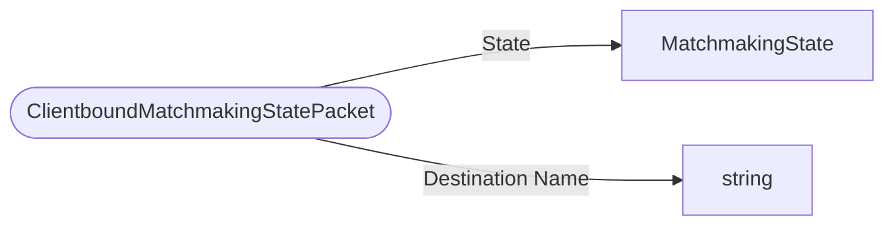

# ClientboundMatchmakingStatePacket

`packet` - id **353**

```mermaid
flowchart LR
  ROOT(["ClientboundMatchmakingStatePacket"])
  ROOT -->|"State"| MatchmakingState["MatchmakingState"]
  ROOT -->|"Destination Name"| string["string"]
```

