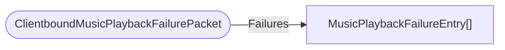

# ClientboundMusicPlaybackFailurePacket

`packet` - id **365**

```mermaid
flowchart LR
  ROOT(["ClientboundMusicPlaybackFailurePacket"])
  ROOT -->|"Failures"| MusicPlaybackFailureEntry["MusicPlaybackFailureEntry[]"]
```

