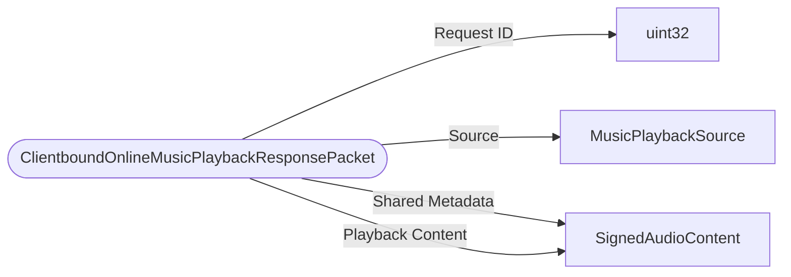

# ClientboundOnlineMusicPlaybackResponsePacket

`packet` - id **363**

```mermaid
flowchart LR
  ROOT(["ClientboundOnlineMusicPlaybackResponsePacket"])
  ROOT -->|"Request ID"| uint32["uint32"]
  ROOT -->|"Source"| MusicPlaybackSource["MusicPlaybackSource"]
  ROOT -->|"Shared Metadata"| SignedAudioContent["SignedAudioContent"]
  ROOT -->|"Playback Content"| SignedAudioContent["SignedAudioContent"]
```

