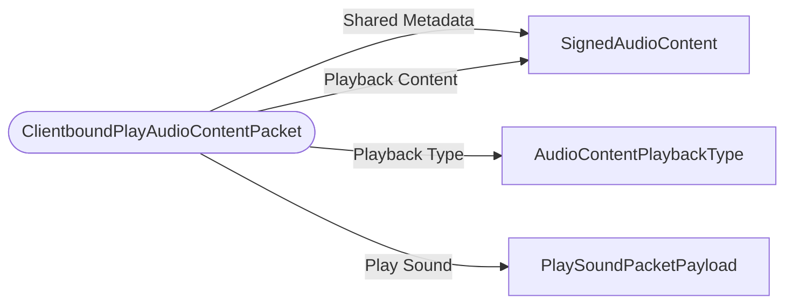

# ClientboundPlayAudioContentPacket

`packet` - id **359**

```mermaid
flowchart LR
  ROOT(["ClientboundPlayAudioContentPacket"])
  ROOT -->|"Shared Metadata"| SignedAudioContent["SignedAudioContent"]
  ROOT -->|"Playback Content"| SignedAudioContent["SignedAudioContent"]
  ROOT -->|"Playback Type"| AudioContentPlaybackType["AudioContentPlaybackType"]
  ROOT -->|"Play Sound"| PlaySoundPacketPayload["PlaySoundPacketPayload"]
```

