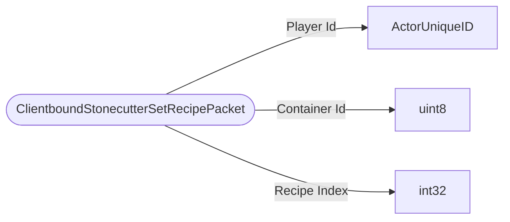

# ClientboundStonecutterSetRecipePacket

`packet` - id **355**

```mermaid
flowchart LR
  ROOT(["ClientboundStonecutterSetRecipePacket"])
  ROOT -->|"Player Id"| ActorUniqueID["ActorUniqueID"]
  ROOT -->|"Container Id"| uint8["uint8"]
  ROOT -->|"Recipe Index"| int32["int32"]
```

