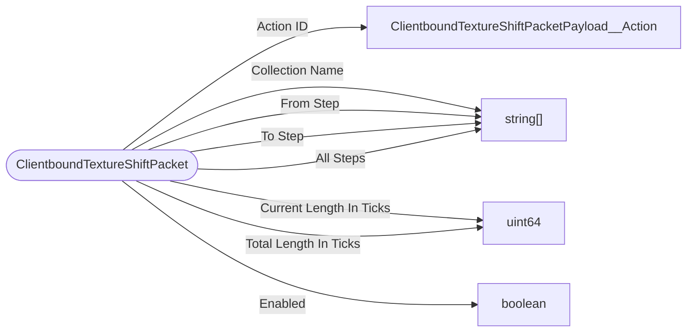

# ClientboundTextureShiftPacket

`packet` - id **336**

```mermaid
flowchart LR
  ROOT(["ClientboundTextureShiftPacket"])
  ROOT -->|"Action ID"| ClientboundTextureShiftPacketPayload__Action["ClientboundTextureShiftPacketPayload__Action"]
  ROOT -->|"Collection Name"| string["string"]
  ROOT -->|"From Step"| string["string"]
  ROOT -->|"To Step"| string["string"]
  ROOT -->|"All Steps"| string["string[]"]
  ROOT -->|"Current Length In Ticks"| uint64["uint64"]
  ROOT -->|"Total Length In Ticks"| uint64["uint64"]
  ROOT -->|"Enabled"| boolean["boolean"]
```

