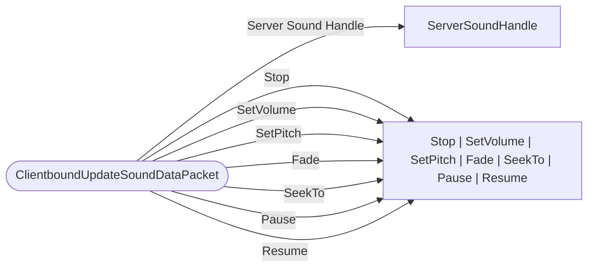

# ClientboundUpdateSoundDataPacket

`packet` - id **348**

```mermaid
flowchart LR
  ROOT(["ClientboundUpdateSoundDataPacket"])
  ROOT -->|"Server Sound Handle"| ServerSoundHandle["ServerSoundHandle"]
  ROOT -->|"Stop"| Stop___SetVolume___SetPitch___Fade___SeekTo___Pause___Resume["Stop | SetVolume | SetPitch | Fade | SeekTo | Pause | Resume"]
  ROOT -->|"SetVolume"| Stop___SetVolume___SetPitch___Fade___SeekTo___Pause___Resume["Stop | SetVolume | SetPitch | Fade | SeekTo | Pause | Resume"]
  ROOT -->|"SetPitch"| Stop___SetVolume___SetPitch___Fade___SeekTo___Pause___Resume["Stop | SetVolume | SetPitch | Fade | SeekTo | Pause | Resume"]
  ROOT -->|"Fade"| Stop___SetVolume___SetPitch___Fade___SeekTo___Pause___Resume["Stop | SetVolume | SetPitch | Fade | SeekTo | Pause | Resume"]
  ROOT -->|"SeekTo"| Stop___SetVolume___SetPitch___Fade___SeekTo___Pause___Resume["Stop | SetVolume | SetPitch | Fade | SeekTo | Pause | Resume"]
  ROOT -->|"Pause"| Stop___SetVolume___SetPitch___Fade___SeekTo___Pause___Resume["Stop | SetVolume | SetPitch | Fade | SeekTo | Pause | Resume"]
  ROOT -->|"Resume"| Stop___SetVolume___SetPitch___Fade___SeekTo___Pause___Resume["Stop | SetVolume | SetPitch | Fade | SeekTo | Pause | Resume"]
```

