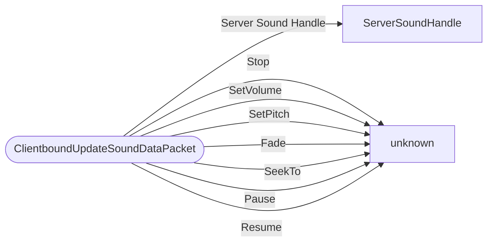

# ClientboundUpdateSoundDataPacket

`packet` - id **348**

- protocol: 2168
- minecraft: 1.26.40

```mermaid
flowchart LR
  ROOT(["ClientboundUpdateSoundDataPacket"])
  ROOT -->|"Server Sound Handle"| ServerSoundHandle["ServerSoundHandle"]
  ROOT -->|"Stop"| unknown["unknown"]
  ROOT -->|"SetVolume"| unknown["unknown"]
  ROOT -->|"SetPitch"| unknown["unknown"]
  ROOT -->|"Fade"| unknown["unknown"]
  ROOT -->|"SeekTo"| unknown["unknown"]
  ROOT -->|"Pause"| unknown["unknown"]
  ROOT -->|"Resume"| unknown["unknown"]
```

