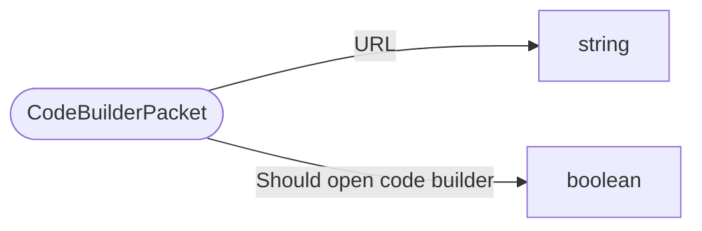

# CodeBuilderPacket

`packet` - id **150**

- protocol: 2168
- minecraft: 1.26.40

This is EDU exclusively.It is sent once from _sendLevelData() in the start of a game from the server,
	and once per CodeBuilderCommand

