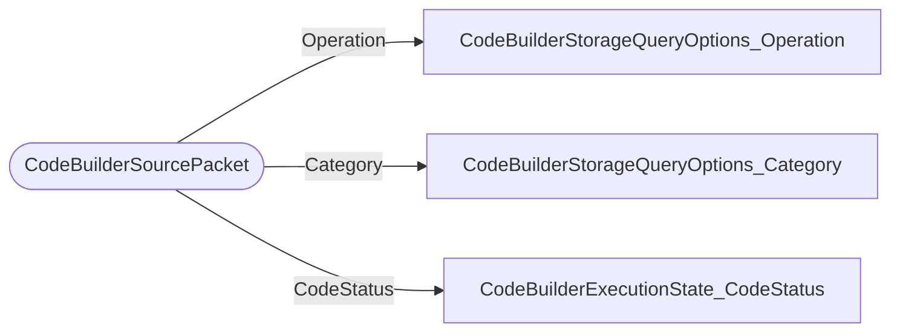

# CodeBuilderSourcePacket

`packet` - id **178**

- protocol: 2168
- minecraft: 1.26.40

```mermaid
flowchart LR
  ROOT(["CodeBuilderSourcePacket"])
  ROOT -->|"Operation"| CodeBuilderStorageQueryOptions_Operation["CodeBuilderStorageQueryOptions_Operation"]
  ROOT -->|"Category"| CodeBuilderStorageQueryOptions_Category["CodeBuilderStorageQueryOptions_Category"]
  ROOT -->|"CodeStatus"| CodeBuilderExecutionState_CodeStatus["CodeBuilderExecutionState_CodeStatus"]
```

