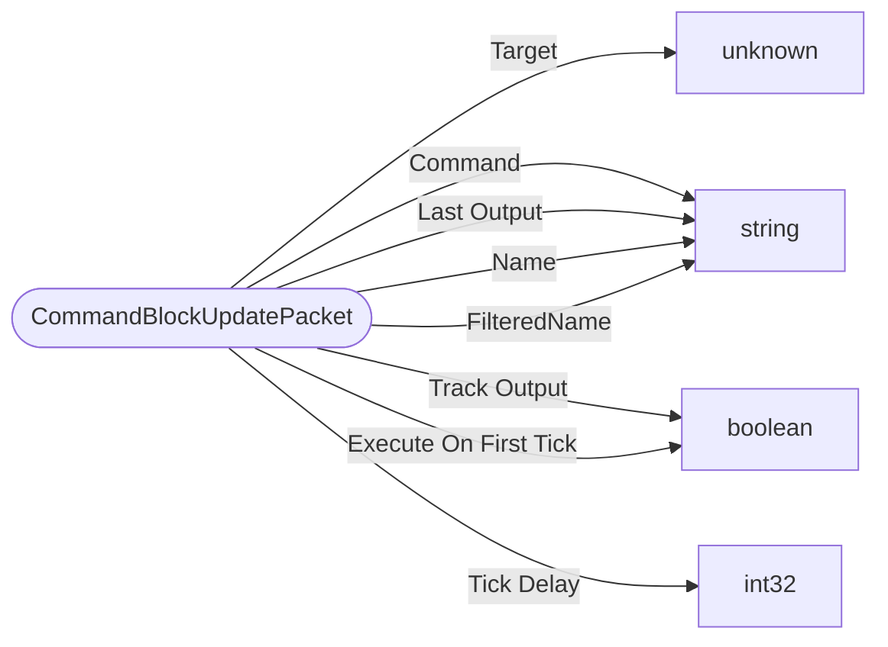

# CommandBlockUpdatePacket

`packet` - id **78**

- protocol: 2168
- minecraft: 1.26.40

Sent when you close the command block screen on the client.

```mermaid
flowchart LR
  ROOT(["CommandBlockUpdatePacket"])
  ROOT -->|"Target"| unknown["unknown"]
  ROOT -->|"Command"| string["string"]
  ROOT -->|"Last Output"| string["string"]
  ROOT -->|"Name"| string["string"]
  ROOT -->|"FilteredName"| string["string"]
  ROOT -->|"Track Output"| boolean["boolean"]
  ROOT -->|"Tick Delay"| int32["int32"]
  ROOT -->|"Execute On First Tick"| boolean["boolean"]
```

