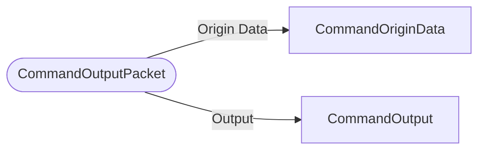

# CommandOutputPacket

`packet` - id **79**

```mermaid
flowchart LR
  ROOT(["CommandOutputPacket"])
  ROOT -->|"Origin Data"| CommandOriginData["CommandOriginData"]
  ROOT -->|"Output"| CommandOutput["CommandOutput"]
```

