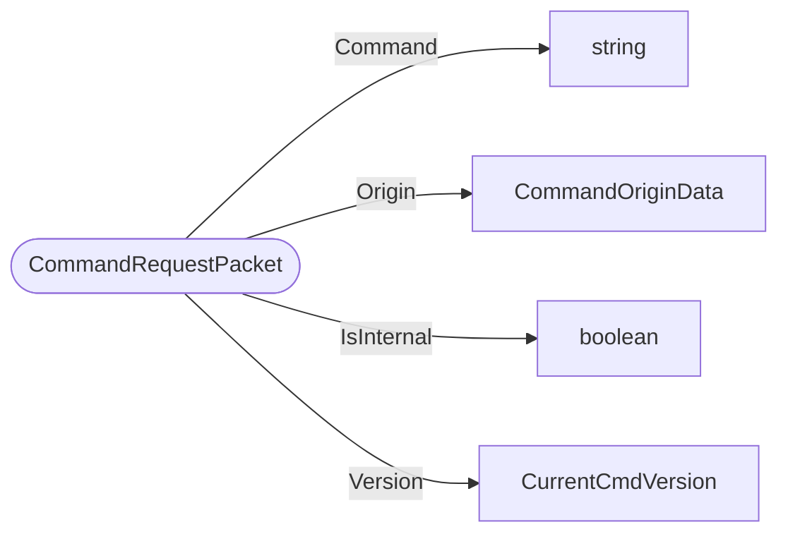

# CommandRequestPacket

`packet` - id **77**

- protocol: 2168
- minecraft: 1.26.40

```mermaid
flowchart LR
  ROOT(["CommandRequestPacket"])
  ROOT -->|"Command"| string["string"]
  ROOT -->|"Origin"| CommandOriginData["CommandOriginData"]
  ROOT -->|"IsInternal"| boolean["boolean"]
  ROOT -->|"Version"| CurrentCmdVersion["CurrentCmdVersion"]
```

