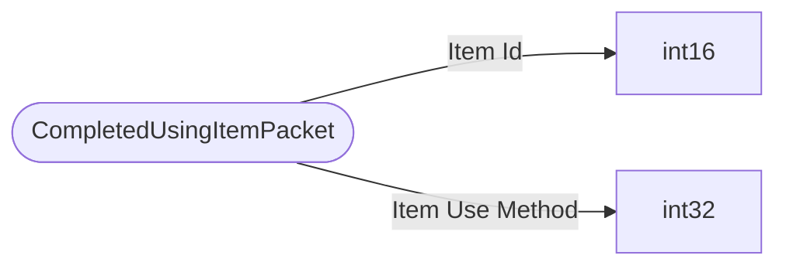

# CompletedUsingItemPacket

`packet` - id **142**

```mermaid
flowchart LR
  ROOT(["CompletedUsingItemPacket"])
  ROOT -->|"Item Id"| int16["int16"]
  ROOT -->|"Item Use Method"| int32["int32"]
```

