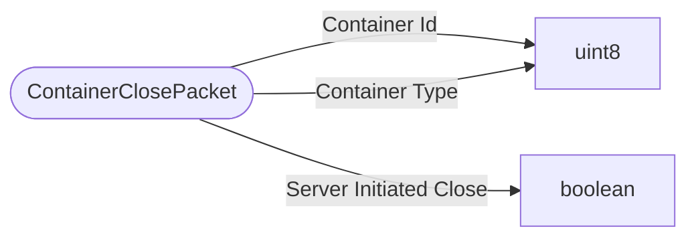

# ContainerClosePacket

`packet` - id **47**

- protocol: 2168
- minecraft: 1.26.40

```mermaid
flowchart LR
  ROOT(["ContainerClosePacket"])
  ROOT -->|"Container Id"| uint8["uint8"]
  ROOT -->|"Container Type"| uint8["uint8"]
  ROOT -->|"Server Initiated Close"| boolean["boolean"]
```

