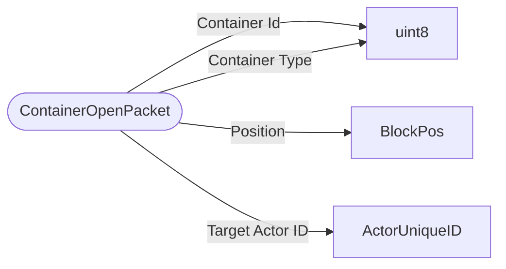

# ContainerOpenPacket

`packet` - id **46**

- protocol: 2168
- minecraft: 1.26.40

```mermaid
flowchart LR
  ROOT(["ContainerOpenPacket"])
  ROOT -->|"Container Id"| uint8["uint8"]
  ROOT -->|"Container Type"| uint8["uint8"]
  ROOT -->|"Position"| BlockPos["BlockPos"]
  ROOT -->|"Target Actor ID"| ActorUniqueID["ActorUniqueID"]
```

