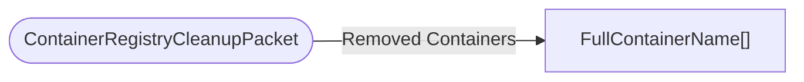

# ContainerRegistryCleanupPacket

`packet` - id **317**

- protocol: 2168
- minecraft: 1.26.40

	Whenever the serverside ContainerRegistry does a clean, identifiers for the removed containers are gathered in a ContainerRegistryCleanUp
	packet and sent to the client so that the clientside container registry can remove those same containers.
	

