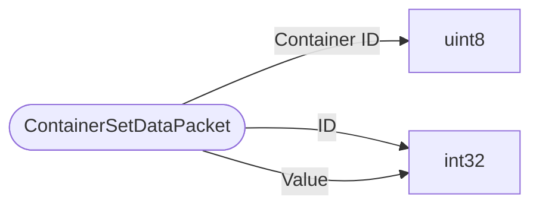

# ContainerSetDataPacket

`packet` - id **51**

```mermaid
flowchart LR
  ROOT(["ContainerSetDataPacket"])
  ROOT -->|"Container ID"| uint8["uint8"]
  ROOT -->|"ID"| int32["int32"]
  ROOT -->|"Value"| int32["int32"]
```

