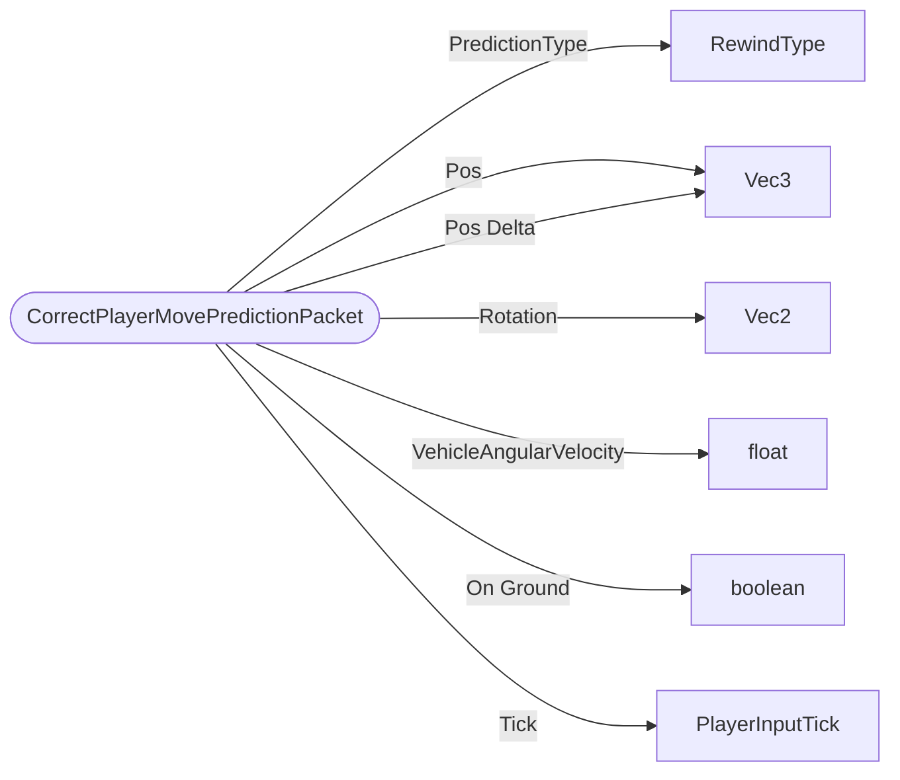

# CorrectPlayerMovePredictionPacket

`packet` - id **161**

Used only in server authoritative movement mode, see ServerAuthMovementMode documentation. 
	Since it is sent to the specified client the target player is implied to be the receiver. 
	It is an optional part of the server authoritative protocol. A server could choose to never send this or do all corrections
	through MovePlayerPacket, although doing so would likely provide less smooth results.

