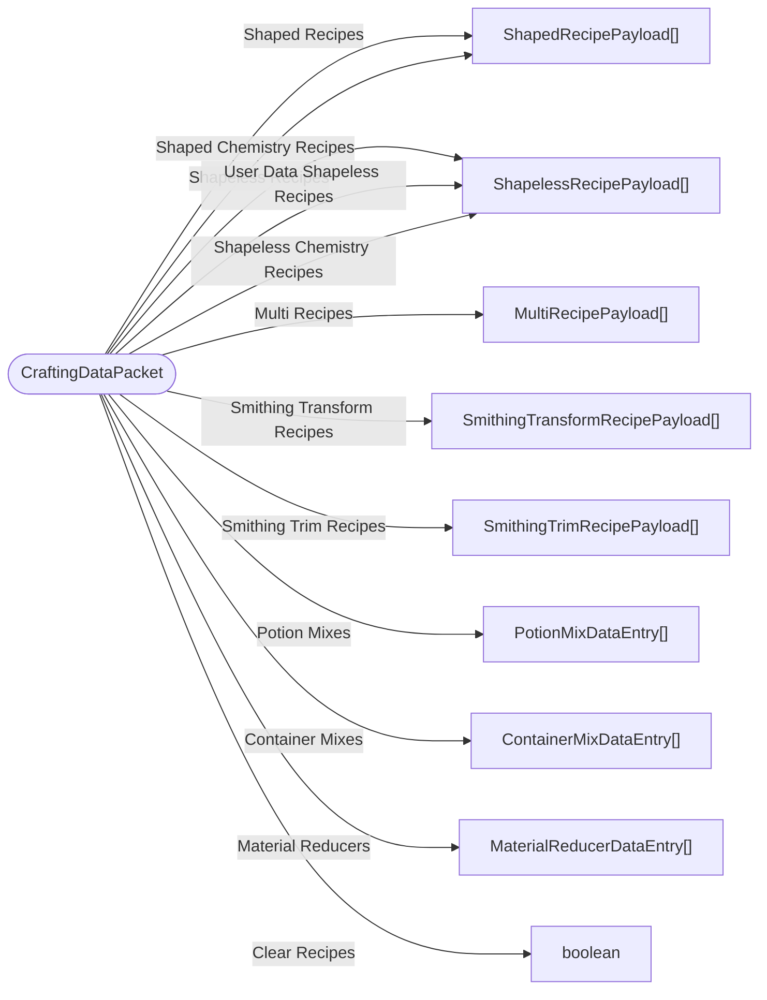

# CraftingDataPacket

`packet` - id **52**

Sent from the server on level startup to send all recipes to the client.

```mermaid
flowchart LR
  ROOT(["CraftingDataPacket"])
  ROOT -->|"Shaped Recipes"| ShapedRecipePayload["ShapedRecipePayload[]"]
  ROOT -->|"Shapeless Recipes"| ShapelessRecipePayload["ShapelessRecipePayload[]"]
  ROOT -->|"Multi Recipes"| MultiRecipePayload["MultiRecipePayload[]"]
  ROOT -->|"User Data Shapeless Recipes"| ShapelessRecipePayload["ShapelessRecipePayload[]"]
  ROOT -->|"Shapeless Chemistry Recipes"| ShapelessRecipePayload["ShapelessRecipePayload[]"]
  ROOT -->|"Shaped Chemistry Recipes"| ShapedRecipePayload["ShapedRecipePayload[]"]
  ROOT -->|"Smithing Transform Recipes"| SmithingTransformRecipePayload["SmithingTransformRecipePayload[]"]
  ROOT -->|"Smithing Trim Recipes"| SmithingTrimRecipePayload["SmithingTrimRecipePayload[]"]
  ROOT -->|"Potion Mixes"| PotionMixDataEntry["PotionMixDataEntry[]"]
  ROOT -->|"Container Mixes"| ContainerMixDataEntry["ContainerMixDataEntry[]"]
  ROOT -->|"Material Reducers"| MaterialReducerDataEntry["MaterialReducerDataEntry[]"]
  ROOT -->|"Clear Recipes"| boolean["boolean"]
```

