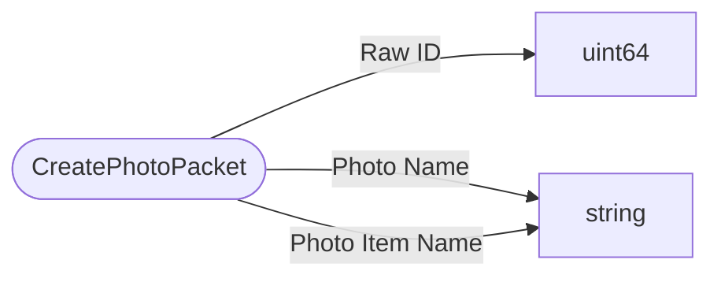

# CreatePhotoPacket

`packet` - id **171**

```mermaid
flowchart LR
  ROOT(["CreatePhotoPacket"])
  ROOT -->|"Raw ID"| uint64["uint64"]
  ROOT -->|"Photo Name"| string["string"]
  ROOT -->|"Photo Item Name"| string["string"]
```

