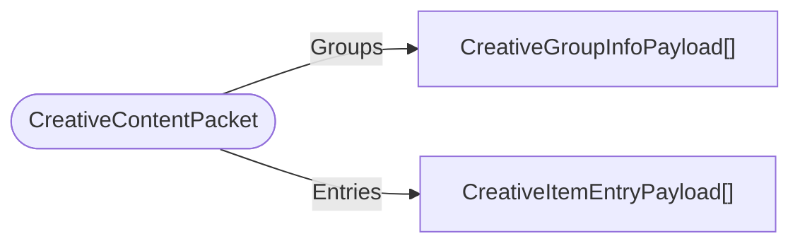

# CreativeContentPacket

`packet` - id **145**

- protocol: 2168
- minecraft: 1.26.40

Sent once by the server on startup to tell clients all of the items that can show up in the creative menu and recipe book.

