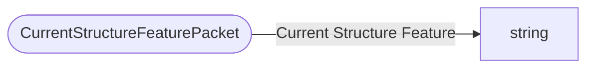

# CurrentStructureFeaturePacket

`packet` - id **314**

Sends the name of the Structure Feature the player is currently occupying to the client.
	If the player is not in a structure, this packet contains an empty string.

