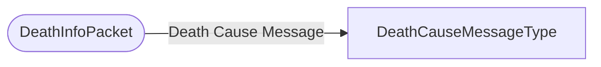

# DeathInfoPacket

`packet` - id **189**

- protocol: 2168
- minecraft: 1.26.40

mDeathCauseMessage: is untranslated cause of death string vector returned from ActorDamageSource

```mermaid
flowchart LR
  ROOT(["DeathInfoPacket"])
  ROOT -->|"Death Cause Message"| DeathCauseMessageType["DeathCauseMessageType"]
```

