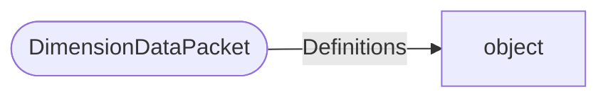

# DimensionDataPacket

`packet` - id **180**

Contains dimension definition data including height bounds and generator type for each dimension.

```mermaid
flowchart LR
  ROOT(["DimensionDataPacket"])
  ROOT -->|"Definitions"| object["object"]
```

