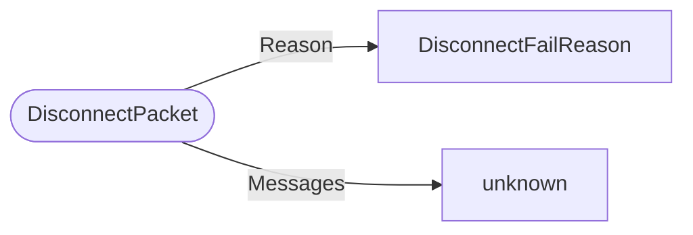

# DisconnectPacket

`packet` - id **5**

```mermaid
flowchart LR
  ROOT(["DisconnectPacket"])
  ROOT -->|"Reason"| DisconnectFailReason["DisconnectFailReason"]
  ROOT -->|"Messages"| unknown["unknown"]
```

