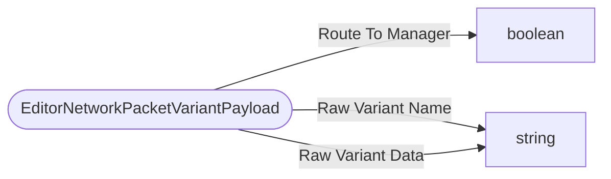

# EditorNetworkPacketVariantPayload

`packet`

```mermaid
flowchart LR
  ROOT(["EditorNetworkPacketVariantPayload"])
  ROOT -->|"Route To Manager"| boolean["boolean"]
  ROOT -->|"Raw Variant Name"| string["string"]
  ROOT -->|"Raw Variant Data"| string["string"]
```

