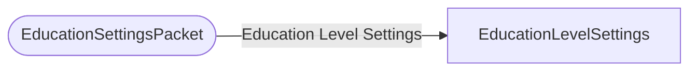

# EducationSettingsPacket

`packet` - id **137**

- protocol: 2168
- minecraft: 1.26.40

Currently transmits EducationLevelSettings to all clients when the game is starting.

```mermaid
flowchart LR
  ROOT(["EducationSettingsPacket"])
  ROOT -->|"Education Level Settings"| EducationLevelSettings["EducationLevelSettings"]
```

