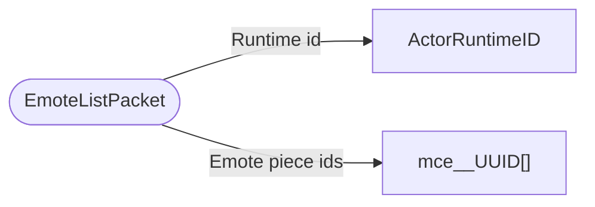

# EmoteListPacket

`packet` - id **152**

- protocol: 2168
- minecraft: 1.26.40

```mermaid
flowchart LR
  ROOT(["EmoteListPacket"])
  ROOT -->|"Runtime id"| ActorRuntimeID["ActorRuntimeID"]
  ROOT -->|"Emote piece ids"| mce__UUID["mce__UUID[]"]
```

