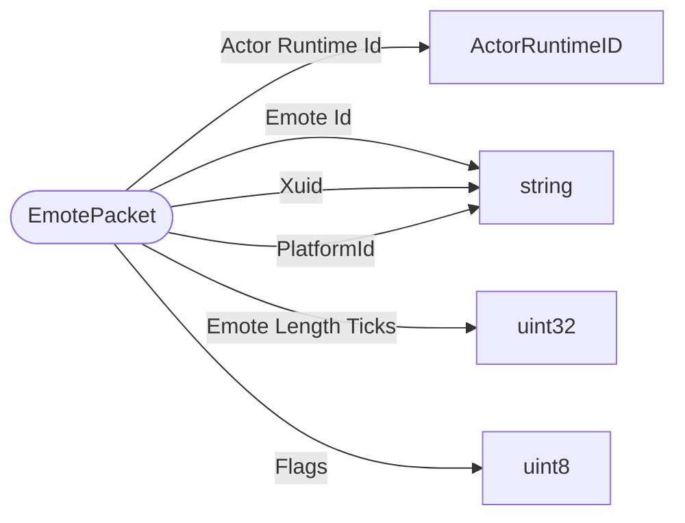

# EmotePacket

`packet` - id **138**

- protocol: 2168
- minecraft: 1.26.40

Sent in both directions; by client to request that an emote is played and then from the server to the clients to indicate which player needs to now emote.

