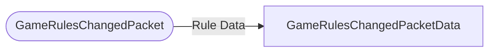

# GameRulesChangedPacket

`packet` - id **72**

Informs client about any changes to the game rules.

```mermaid
flowchart LR
  ROOT(["GameRulesChangedPacket"])
  ROOT -->|"Rule Data"| GameRulesChangedPacketData["GameRulesChangedPacketData"]
```

