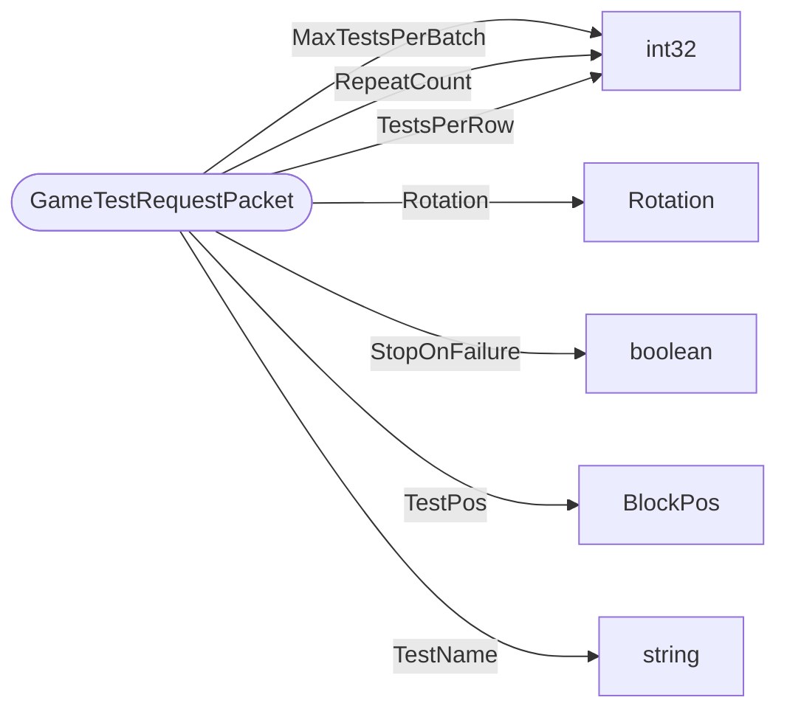

# GameTestRequestPacket

`packet` - id **194**

```mermaid
flowchart LR
  ROOT(["GameTestRequestPacket"])
  ROOT -->|"MaxTestsPerBatch"| int32["int32"]
  ROOT -->|"RepeatCount"| int32["int32"]
  ROOT -->|"Rotation"| Rotation["Rotation"]
  ROOT -->|"StopOnFailure"| boolean["boolean"]
  ROOT -->|"TestPos"| BlockPos["BlockPos"]
  ROOT -->|"TestsPerRow"| int32["int32"]
  ROOT -->|"TestName"| string["string"]
```

