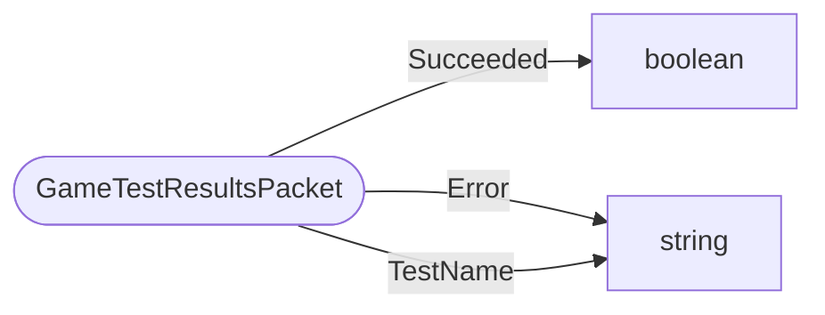

# GameTestResultsPacket

`packet` - id **195**

Internal Text Packet

```mermaid
flowchart LR
  ROOT(["GameTestResultsPacket"])
  ROOT -->|"Succeeded"| boolean["boolean"]
  ROOT -->|"Error"| string["string"]
  ROOT -->|"TestName"| string["string"]
```

