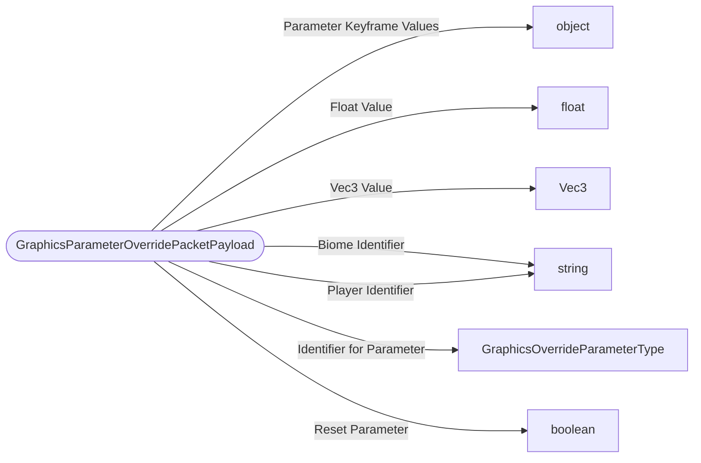

# GraphicsParameterOverridePacketPayload

`packet`

```mermaid
flowchart LR
  ROOT(["GraphicsParameterOverridePacketPayload"])
  ROOT -->|"Parameter Keyframe Values"| object["object"]
  ROOT -->|"Float Value"| float["float"]
  ROOT -->|"Vec3 Value"| Vec3["Vec3"]
  ROOT -->|"Biome Identifier"| string["string"]
  ROOT -->|"Player Identifier"| string["string"]
  ROOT -->|"Identifier for Parameter"| GraphicsOverrideParameterType["GraphicsOverrideParameterType"]
  ROOT -->|"Reset Parameter"| boolean["boolean"]
```

