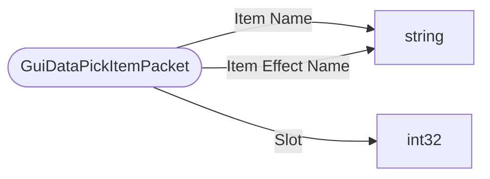

# GuiDataPickItemPacket

`packet` - id **54**

This is only used when players use pick block, a command is used, tests, and some 3rd party content.

```mermaid
flowchart LR
  ROOT(["GuiDataPickItemPacket"])
  ROOT -->|"Item Name"| string["string"]
  ROOT -->|"Item Effect Name"| string["string"]
  ROOT -->|"Slot"| int32["int32"]
```

