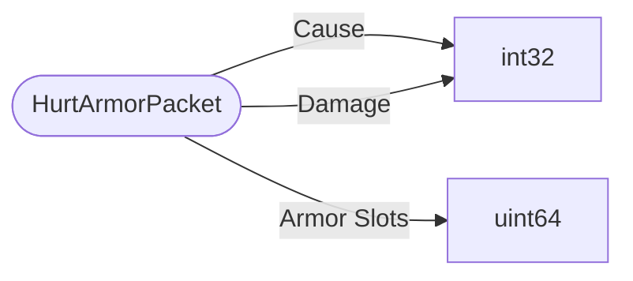

# HurtArmorPacket

`packet` - id **38**

Sends the damage taken after armor is taken into account. This looks like it is trying to be phased out, this is not sent while the ItemStackNetManagerServer is active. From the server.

