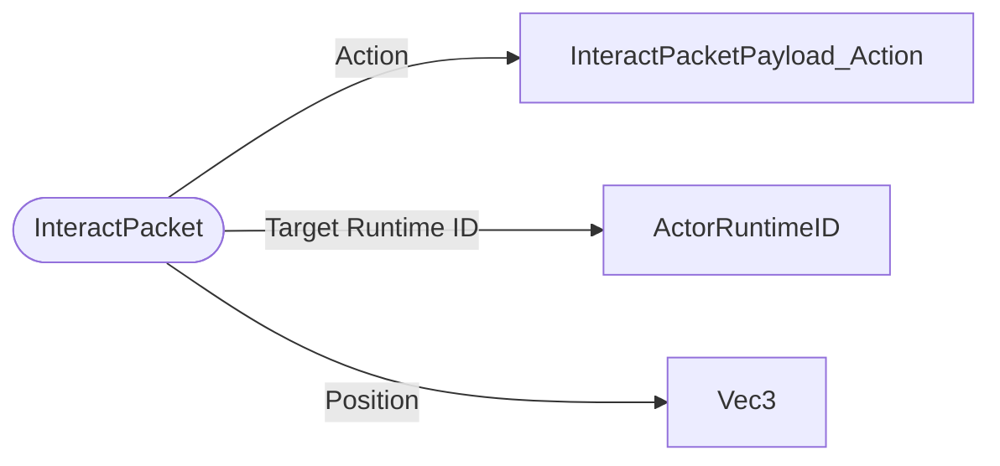

# InteractPacket

`packet` - id **33**

Used for inventory button press and in _updateInteraction() for a variety of purposes. From the client.

```mermaid
flowchart LR
  ROOT(["InteractPacket"])
  ROOT -->|"Action"| InteractPacketPayload_Action["InteractPacketPayload_Action"]
  ROOT -->|"Target Runtime ID"| ActorRuntimeID["ActorRuntimeID"]
  ROOT -->|"Position"| Vec3["Vec3"]
```

