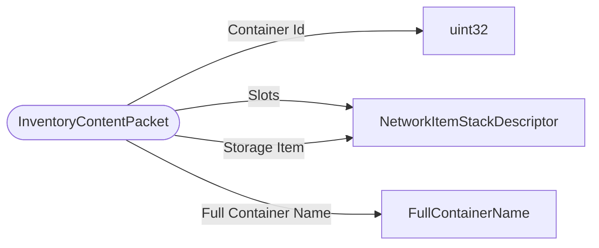

# InventoryContentPacket

`packet` - id **49**

- protocol: 2168
- minecraft: 1.26.40

```mermaid
flowchart LR
  ROOT(["InventoryContentPacket"])
  ROOT -->|"Container Id"| uint32["uint32"]
  ROOT -->|"Slots"| NetworkItemStackDescriptor["NetworkItemStackDescriptor[]"]
  ROOT -->|"Full Container Name"| FullContainerName["FullContainerName"]
  ROOT -->|"Storage Item"| NetworkItemStackDescriptor["NetworkItemStackDescriptor"]
```

