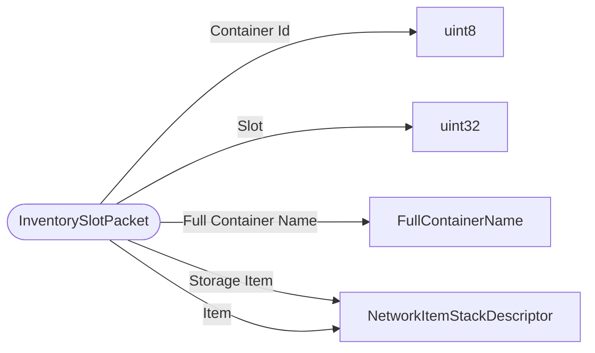

# InventorySlotPacket

`packet` - id **50**

- protocol: 2168
- minecraft: 1.26.40

```mermaid
flowchart LR
  ROOT(["InventorySlotPacket"])
  ROOT -->|"Container Id"| uint8["uint8"]
  ROOT -->|"Slot"| uint32["uint32"]
  ROOT -->|"Full Container Name"| FullContainerName["FullContainerName"]
  ROOT -->|"Storage Item"| NetworkItemStackDescriptor["NetworkItemStackDescriptor"]
  ROOT -->|"Item"| NetworkItemStackDescriptor["NetworkItemStackDescriptor"]
```

