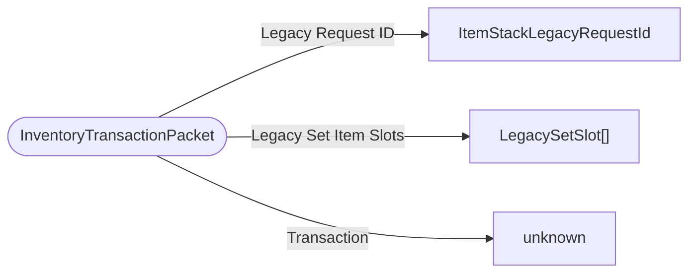

# InventoryTransactionPacket

`packet` - id **30**

- protocol: 2168
- minecraft: 1.26.40

```mermaid
flowchart LR
  ROOT(["InventoryTransactionPacket"])
  ROOT -->|"Legacy Request ID"| ItemStackLegacyRequestId["ItemStackLegacyRequestId"]
  ROOT -->|"Legacy Set Item Slots"| LegacySetSlot["LegacySetSlot[]"]
  ROOT -->|"Transaction"| unknown["unknown"]
```

