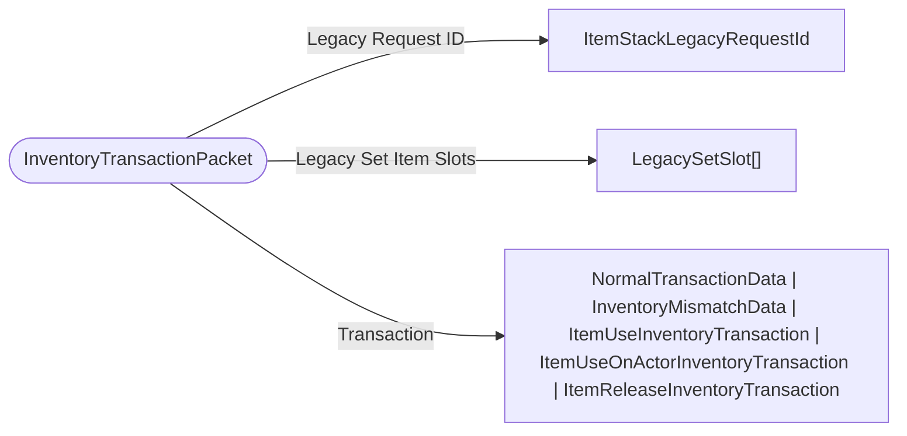

# InventoryTransactionPacket

`packet` - id **30**

```mermaid
flowchart LR
  ROOT(["InventoryTransactionPacket"])
  ROOT -->|"Legacy Request ID"| ItemStackLegacyRequestId["ItemStackLegacyRequestId"]
  ROOT -->|"Legacy Set Item Slots"| LegacySetSlot["LegacySetSlot[]"]
  ROOT -->|"Transaction"| NormalTransactionData___InventoryMismatchData___ItemUseInventoryTransaction___ItemUseOnActorInventoryTransaction___ItemReleaseInventoryTransaction["NormalTransactionData | InventoryMismatchData | ItemUseInventoryTransaction | ItemUseOnActorInventoryTransaction | ItemReleaseInventoryTransaction"]
```

