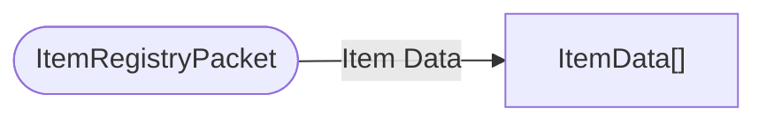

# ItemRegistryPacket

`packet` - id **162**

- protocol: 2168
- minecraft: 1.26.40

This packet needs to be sent immediately after the StartGamePacket for primary clients.

```mermaid
flowchart LR
  ROOT(["ItemRegistryPacket"])
  ROOT -->|"Item Data"| ItemData["ItemData[]"]
```

