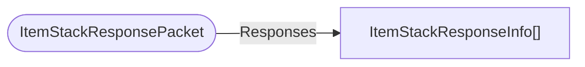

# ItemStackResponsePacket

`packet` - id **148**

- protocol: 2168
- minecraft: 1.26.40

```mermaid
flowchart LR
  ROOT(["ItemStackResponsePacket"])
  ROOT -->|"Responses"| ItemStackResponseInfo["ItemStackResponseInfo[]"]
```

