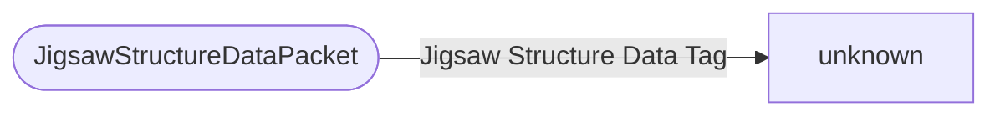

# JigsawStructureDataPacket

`packet` - id **313**

Sends the serialized jigsaw rule JSON to the client as it's needed on both the client and server.

```mermaid
flowchart LR
  ROOT(["JigsawStructureDataPacket"])
  ROOT -->|"Jigsaw Structure Data Tag"| unknown["unknown"]
```

