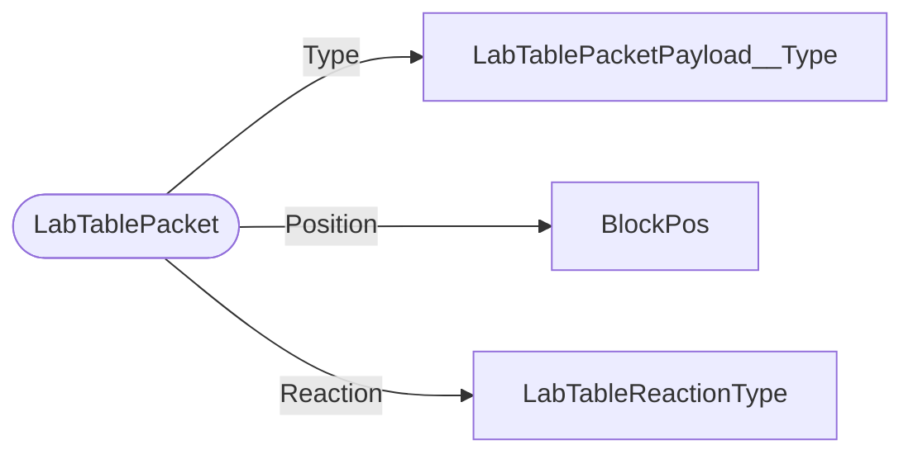

# LabTablePacket

`packet` - id **109**

The packet can be fired from the client through the UI or from the server during updates.

```mermaid
flowchart LR
  ROOT(["LabTablePacket"])
  ROOT -->|"Type"| LabTablePacketPayload__Type["LabTablePacketPayload__Type"]
  ROOT -->|"Position"| BlockPos["BlockPos"]
  ROOT -->|"Reaction"| LabTableReactionType["LabTableReactionType"]
```

