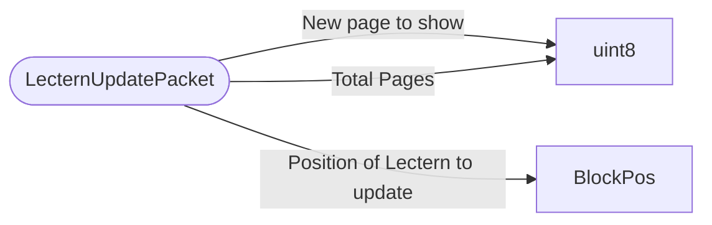

# LecternUpdatePacket

`packet` - id **125**

It is a request from the client to either turn the page in the lectern or drop the book.

```mermaid
flowchart LR
  ROOT(["LecternUpdatePacket"])
  ROOT -->|"New page to show"| uint8["uint8"]
  ROOT -->|"Total Pages"| uint8["uint8"]
  ROOT -->|"Position of Lectern to update"| BlockPos["BlockPos"]
```

