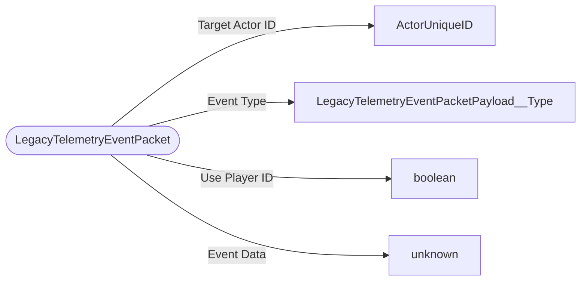

# LegacyTelemetryEventPacket

`packet` - id **65**

```mermaid
flowchart LR
  ROOT(["LegacyTelemetryEventPacket"])
  ROOT -->|"Target Actor ID"| ActorUniqueID["ActorUniqueID"]
  ROOT -->|"Event Type"| LegacyTelemetryEventPacketPayload__Type["LegacyTelemetryEventPacketPayload__Type"]
  ROOT -->|"Use Player ID"| boolean["boolean"]
  ROOT -->|"Event Data"| unknown["unknown"]
```

