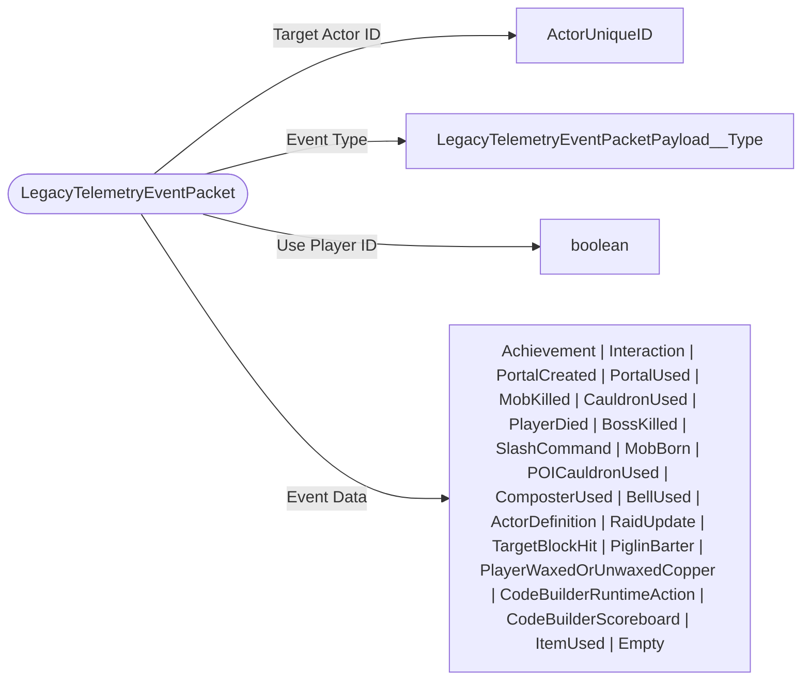

# LegacyTelemetryEventPacket

`packet` - id **65**

```mermaid
flowchart LR
  ROOT(["LegacyTelemetryEventPacket"])
  ROOT -->|"Target Actor ID"| ActorUniqueID["ActorUniqueID"]
  ROOT -->|"Event Type"| LegacyTelemetryEventPacketPayload__Type["LegacyTelemetryEventPacketPayload__Type"]
  ROOT -->|"Use Player ID"| boolean["boolean"]
  ROOT -->|"Event Data"| Achievement___Interaction___PortalCreated___PortalUsed___MobKilled___CauldronUsed___PlayerDied___BossKilled___SlashCommand___MobBorn___POICauldronUsed___ComposterUsed___BellUsed___ActorDefinition___RaidUpdate___TargetBlockHit___PiglinBarter___PlayerWaxedOrUnwaxedCopper___CodeBuilderRuntimeAction___CodeBuilderScoreboard___ItemUsed___Empty["Achievement | Interaction | PortalCreated | PortalUsed | MobKilled | CauldronUsed | PlayerDied | BossKilled | SlashCommand | MobBorn | POICauldronUsed | ComposterUsed | BellUsed | ActorDefinition | RaidUpdate | TargetBlockHit | PiglinBarter | PlayerWaxedOrUnwaxedCopper | CodeBuilderRuntimeAction | CodeBuilderScoreboard | ItemUsed | Empty"]
```

