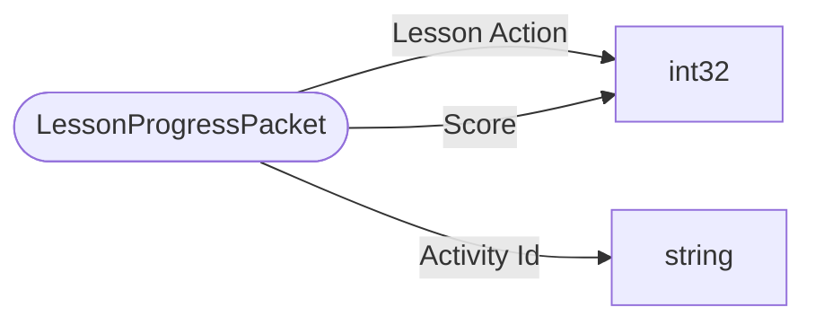

# LessonProgressPacket

`packet` - id **183**

```mermaid
flowchart LR
  ROOT(["LessonProgressPacket"])
  ROOT -->|"Lesson Action"| int32["int32"]
  ROOT -->|"Score"| int32["int32"]
  ROOT -->|"Activity Id"| string["string"]
```

