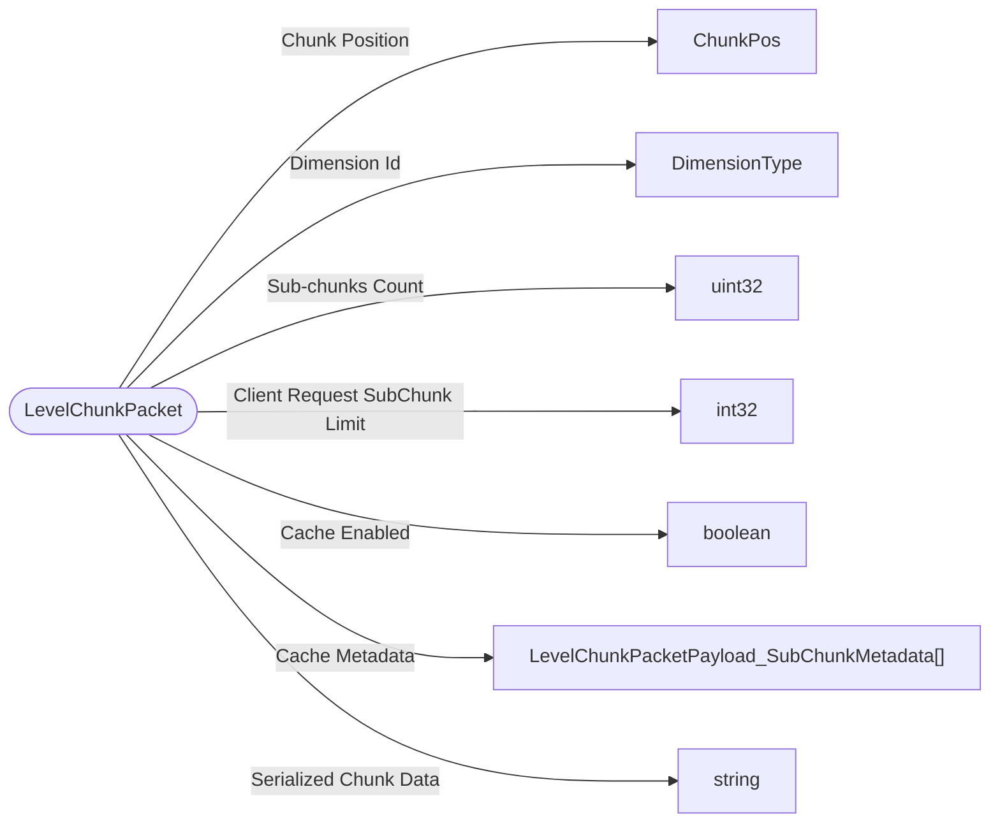

# LevelChunkPacket

`packet` - id **58**

Used to start a chunk transaction.

```mermaid
flowchart LR
  ROOT(["LevelChunkPacket"])
  ROOT -->|"Chunk Position"| ChunkPos["ChunkPos"]
  ROOT -->|"Dimension Id"| DimensionType["DimensionType"]
  ROOT -->|"Sub-chunks Count"| uint32["uint32"]
  ROOT -->|"Client Request SubChunk Limit"| int32["int32"]
  ROOT -->|"Cache Enabled"| boolean["boolean"]
  ROOT -->|"Cache Metadata"| LevelChunkPacketPayload_SubChunkMetadata["LevelChunkPacketPayload_SubChunkMetadata[]"]
  ROOT -->|"Serialized Chunk Data"| string["string"]
```

